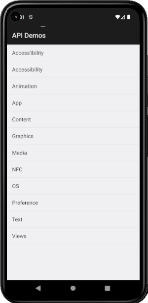

# FirstAppiumProject
### Appium Session Driver Creation Project for Android and IOS.

#### Description: 

This project demonstrates in a simple way, through an example application of the Java main type, how to create/configure a Session Driver of two types as follows:

- **DesiredCapabilities** (class CreateDriverSessionDesiredCapabilities);
- **Options** (class CreateDriverSessionSessionUsingOption).

#### Features:

Both approaches to creating/configuring a Session Driver work in a similar way and both the <b>DesiredCapabilities</b> approach and the <b>Options</b> approach can be used without any problems.

The <b>DesiredCapabilities</b> approach creates an instance of an object of the DesiredCapabilities class type and from this instantiated object different configurations can be assigned.

The <b>Options</b> approach creates an instance of an object of the <b>UiAutomator2Options</b> class type, but unlike the <b>DesiredCapabilities</b> approach, this object can be instantiated by assigning it 
several configurations at once, that is, the same configurations that were assigned in the <b>DesiredCapabilities</b> approach now in Options approach are assigned in their instantiation in a concatenated manner.

#### Image:

#### Note:
The newest approach called **Options**, from version 2 of Appium, came to be an alternative to the old **DesiredCapabilities** approach.

#### Observation:
Although there are snippets of IOS code in both the CreateDriverSessionDesiredCapabilities and CreateDriverSessionSessionUsingOption classes, these are not functional at the moment because IOS app codes only 
work on the MAC Operating System and it is not possible to continue creating/configuring them and testing them. 
These are commented.

#### Links Capabilities:
- https://appium.io/docs/en/2.1/guides/caps/  
- https://appium.github.io/appium.io/docs/en/writing-running-appium/caps/

This project was created by **Alexandre Rodrigues da Silva**.